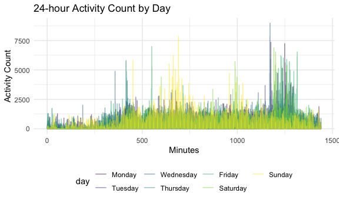

p8105\_hw3\_sl4658
================
Simin Ling
10/9/2020

# Problem 1

``` r
data("instacart")
head(instacart)
```

    ## # A tibble: 6 x 15
    ##   order_id product_id add_to_cart_ord… reordered user_id eval_set order_number
    ##      <int>      <int>            <int>     <int>   <int> <chr>           <int>
    ## 1        1      49302                1         1  112108 train               4
    ## 2        1      11109                2         1  112108 train               4
    ## 3        1      10246                3         0  112108 train               4
    ## 4        1      49683                4         0  112108 train               4
    ## 5        1      43633                5         1  112108 train               4
    ## 6        1      13176                6         0  112108 train               4
    ## # … with 8 more variables: order_dow <int>, order_hour_of_day <int>,
    ## #   days_since_prior_order <int>, product_name <chr>, aisle_id <int>,
    ## #   department_id <int>, aisle <chr>, department <chr>

``` r
summary(instacart)
```

    ##     order_id         product_id    add_to_cart_order   reordered     
    ##  Min.   :      1   Min.   :    1   Min.   : 1.000    Min.   :0.0000  
    ##  1st Qu.: 843370   1st Qu.:13380   1st Qu.: 3.000    1st Qu.:0.0000  
    ##  Median :1701880   Median :25298   Median : 7.000    Median :1.0000  
    ##  Mean   :1706298   Mean   :25556   Mean   : 8.758    Mean   :0.5986  
    ##  3rd Qu.:2568023   3rd Qu.:37940   3rd Qu.:12.000    3rd Qu.:1.0000  
    ##  Max.   :3421070   Max.   :49688   Max.   :80.000    Max.   :1.0000  
    ##     user_id         eval_set          order_number      order_dow    
    ##  Min.   :     1   Length:1384617     Min.   :  4.00   Min.   :0.000  
    ##  1st Qu.: 51732   Class :character   1st Qu.:  6.00   1st Qu.:1.000  
    ##  Median :102933   Mode  :character   Median : 11.00   Median :3.000  
    ##  Mean   :103113                      Mean   : 17.09   Mean   :2.701  
    ##  3rd Qu.:154959                      3rd Qu.: 21.00   3rd Qu.:5.000  
    ##  Max.   :206209                      Max.   :100.00   Max.   :6.000  
    ##  order_hour_of_day days_since_prior_order product_name          aisle_id    
    ##  Min.   : 0.00     Min.   : 0.00          Length:1384617     Min.   :  1.0  
    ##  1st Qu.:10.00     1st Qu.: 7.00          Class :character   1st Qu.: 31.0  
    ##  Median :14.00     Median :15.00          Mode  :character   Median : 83.0  
    ##  Mean   :13.58     Mean   :17.07                             Mean   : 71.3  
    ##  3rd Qu.:17.00     3rd Qu.:30.00                             3rd Qu.:107.0  
    ##  Max.   :23.00     Max.   :30.00                             Max.   :134.0  
    ##  department_id      aisle            department       
    ##  Min.   : 1.00   Length:1384617     Length:1384617    
    ##  1st Qu.: 4.00   Class :character   Class :character  
    ##  Median : 8.00   Mode  :character   Mode  :character  
    ##  Mean   : 9.84                                        
    ##  3rd Qu.:16.00                                        
    ##  Max.   :21.00

### Description of the instacart dataset

There are 1384617 observations in the instacart dataset, with 1384617
rows and 15 columns. Each observations are the level of items in orders
by user, which correspond to order-related information for each product
in each order placed by each user.

Some key variables are user/order related variables, including order id,
user id, product id and name, count of product in each order, order
date, reordered or no, aisle id and name, department and department id,
and more. For example, an user (user id of 112108) placed an order
(order id of 1) that included one Bulgarian Yogurt (product id of 49302)
as a reordered item, in the dairy eggs department and yogurt aisle
(department id of 16 and aisle id of 120).

### Answers to the questions in Problem 1

Problem 1a.

``` r
instacart %>%
  count(aisle) %>%
  arrange(desc(n))
```

    ## # A tibble: 134 x 2
    ##    aisle                              n
    ##    <chr>                          <int>
    ##  1 fresh vegetables              150609
    ##  2 fresh fruits                  150473
    ##  3 packaged vegetables fruits     78493
    ##  4 yogurt                         55240
    ##  5 packaged cheese                41699
    ##  6 water seltzer sparkling water  36617
    ##  7 milk                           32644
    ##  8 chips pretzels                 31269
    ##  9 soy lactosefree                26240
    ## 10 bread                          23635
    ## # … with 124 more rows

There are 134 aisles in the dataset, and the fresh vegetables aisles are
the most items ordered from with an observation count of 150609.

Problem 1b.

``` r
instacart %>%
  count(aisle) %>%
  filter(n > 10000) %>%
  mutate(
    aisle = factor(aisle),
    aisle = fct_reorder(aisle, n)
  ) %>%
  ggplot(aes(x = aisle, y = n, color = aisle)) + geom_point(stat="identity",show.legend = F) + theme(axis.text.x = element_text(angle = 90, vjust = 0.5, hjust = 1))
```


As shown in the graph, the fresh vegetables and fresh fruits aisles are
the ones that have most items sold. The aisles are listed from left to
right in an ascending order of item sold.

Problem 1c.

``` r
instacart %>% 
  filter(aisle %in% c("baking ingredients", "dog food care", "packaged vegetables fruits")) %>% 
  group_by(aisle) %>% 
  count(product_name) %>% 
  mutate(rank = min_rank(desc(n))) %>%
  filter(min_rank(desc(n)) < 4) %>% 
  arrange(aisle, rank) %>%
  knitr::kable()
```

| aisle                      | product\_name                                 |    n | rank |
| :------------------------- | :-------------------------------------------- | ---: | ---: |
| baking ingredients         | Light Brown Sugar                             |  499 |    1 |
| baking ingredients         | Pure Baking Soda                              |  387 |    2 |
| baking ingredients         | Cane Sugar                                    |  336 |    3 |
| dog food care              | Snack Sticks Chicken & Rice Recipe Dog Treats |   30 |    1 |
| dog food care              | Organix Chicken & Brown Rice Recipe           |   28 |    2 |
| dog food care              | Small Dog Biscuits                            |   26 |    3 |
| packaged vegetables fruits | Organic Baby Spinach                          | 9784 |    1 |
| packaged vegetables fruits | Organic Raspberries                           | 5546 |    2 |
| packaged vegetables fruits | Organic Blueberries                           | 4966 |    3 |

The three most popular items in the baking ingredients aisle are light
brown sugar (n=499), pure baking soda (n=387), and can sugar (n=336), in
descending order. The three most popular items in the dog food care
aisle are Snack Sticks Chicken & Rice Recipe Dog Treats (n=30), Organix
Chicken & Brown Rice Recipe (n=28), and Small Dog Biscuits (n=26), in
descending order. The three most popular items in the packaged
vegetables fruits aisle are Organic Baby Spinach (n=9784), Organic
Raspberries (n=5546), and Organic Blueberries (n=4966), in descending
order.

Problem 1d.

``` r
instacart %>% 
  filter(product_name %in% c("Pink Lady Apples", "Coffee Ice Cream")) %>%
  group_by(product_name, order_dow) %>%
  mutate(order_dow = recode(order_dow, `0`="Sun", `1`="Mon", `2`="Tue", `3`="Wed", `4`="Thur", `5`="Fri", `6`="Sat")) %>%
  summarize(mean_hour = mean(order_hour_of_day)) %>% 
  pivot_wider(
    names_from = order_dow,
    values_from = mean_hour
  )
```

    ## `summarise()` regrouping output by 'product_name' (override with `.groups` argument)

    ## # A tibble: 2 x 8
    ## # Groups:   product_name [2]
    ##   product_name       Fri   Mon   Sat   Sun  Thur   Tue   Wed
    ##   <chr>            <dbl> <dbl> <dbl> <dbl> <dbl> <dbl> <dbl>
    ## 1 Coffee Ice Cream  12.3  14.3  13.8  13.8  15.2  15.4  15.3
    ## 2 Pink Lady Apples  12.8  11.4  11.9  13.4  11.6  11.7  14.2

The mean hour of the day at which Pink Lady Apples are ordered are
generally earlier than the mean hour of the day at which Coffee Ice
Cream are ordered, except for Friday.

# Problem 2

## Load, tidy, and otherwise wrangle the data.

``` r
accel_df = read_csv("~/Desktop/Fall 2020/Data Science/accel_data.csv") %>%
  janitor::clean_names() %>%
  pivot_longer(
    activity_1:activity_1440,
    names_to = "minutes",
    names_prefix = "activity_",
    values_to = "activity_count"
    ) %>%
  mutate(day_type = ifelse(day %in% c("Monday", "Tuesday", "Wednesday", "Thursday", "Friday"), "Weekday", "Weekend")) %>%
  mutate(
    day = as.factor(day),
    minutes = as.numeric(minutes),
    day_type = as.factor(day_type),
    day = forcats::fct_relevel(day,c("Monday","Tuesday","Wednesday","Thursday","Friday","Saturday","Sunday"))
  ) 
```

After tidying the data, there are 50400 rows/observations and 6 columns
in the resulting dataset. The variables in the dataset include
information on the week, day (day id, which day, and the type of day),
and minute when the activity count measurement took place, as well as
the measured outcome of activity counts in a short period. The variable
day describes if the measurement was taken on Monday, Tuesday,
Wednesday, Thursday, Friday, Saturday, or Sunday; and the variable
day\_type describes if the measurement was taken on weekday or weekend.

## Using the tidied dataset, aggregate accross minutes to create a total activity variable for each day, and create a table showing these totals.

``` r
accel_df %>% 
  group_by(week, day) %>% 
  summarize(total_activity = sum(activity_count)) %>%
  pivot_wider(
    names_from = day,
    values_from = total_activity
  )
```

    ## `summarise()` regrouping output by 'week' (override with `.groups` argument)

    ## # A tibble: 5 x 8
    ## # Groups:   week [5]
    ##    week  Monday Tuesday Wednesday Thursday  Friday Saturday Sunday
    ##   <dbl>   <dbl>   <dbl>     <dbl>    <dbl>   <dbl>    <dbl>  <dbl>
    ## 1     1  78828. 307094.   340115.  355924. 480543.   376254 631105
    ## 2     2 295431  423245    440962   474048  568839    607175 422018
    ## 3     3 685910  381507    468869   371230  467420    382928 467052
    ## 4     4 409450  319568    434460   340291  154049      1440 260617
    ## 5     5 389080  367824    445366   549658  620860      1440 138421

There is no exact trend observed from the table, as the patient had ups
and downs in the activity count among days and weeks, which led to
different trends that contradict with each other. Despite that the
patient had low activity count on the Saturdays of week 4 and 5, we
still need further analysis to get an observed trend.

## Make a single panel plot that shows the 24-hour activity time courses for each day.

``` r
accel_df %>%
ggplot(aes(x = minutes, y = activity_count, color = day)) + geom_line(aes(group = day), alpha = 0.5) + 
    labs(
      title = "24-hour Activity Count by Day",
      x = "Minutes",
      y = "Activity Count"
    )
```



According to the graph, we can see that the patient is generally more
active during the night around 8pm and during the morning/noon around
10am to 12pm. The patient has relatively low activity count during the
approximate time range from 11pm to 6am, which makes sense because this
is the sleeping time. There is no apparent difference among the activity
count between days of the week, but there is a trend that demonstrates
difference among the activity count between time of the day.
